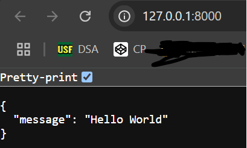

# social_media_fast_api

simple social media api

1. create virtual environment and install fastapi

```shell
virtualenv fenv
.\fenv\Scripts\activate
pip install "fastapi[all]"
pip freeze > requirements.txt
```

2. create firstapp

```python
from fastapi import FastAPI

app = FastAPI()

@app.get("/")
async def root():
    return {"message": "Hello World"}
```

3.Run App

```Shell
unicorn main:app --reload
```

- Here main is the name of the file
- and app is the name of our FastApi instance


